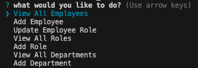

# employee-tracker

## Description

This application based in the command-line interface is a tool that allows a user to set up an employee tracker that moniters an employee, their department, their role, and their manager (if applicable). The user clicks through an array of menu options to naivagate to their intended data entry.

## Table of Contents

- [Installation](#installation)
- [Usage](#usage)
- [Credits](#credits)
- [License](#license)

## Installation

This project requires installations of Node.js and Inquirer. Here's where you can download these packages:
- Node: https://nodejs.org/en/download
- Inquirer: https://www.npmjs.com/package/inquirer/v/8.2.4  

## Usage

To view the sample data provided in the seeds, run the schema and the seeds in mysql. To use the interface for your own db, type 'node index' in your command line and follow the prompts!

## Credits

Columbia University Coding Bootcamp

## License

MIT License

## How to Contribute

Keep tabs on the [Contributor Covenant](https://www.contributor-covenant.org/)!
